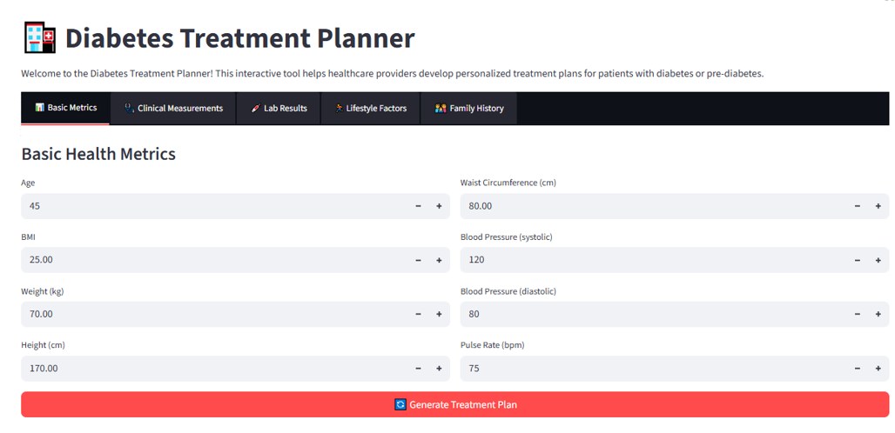
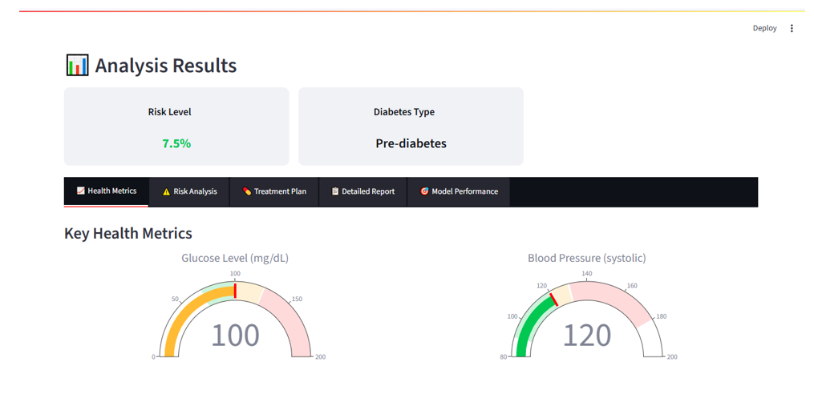
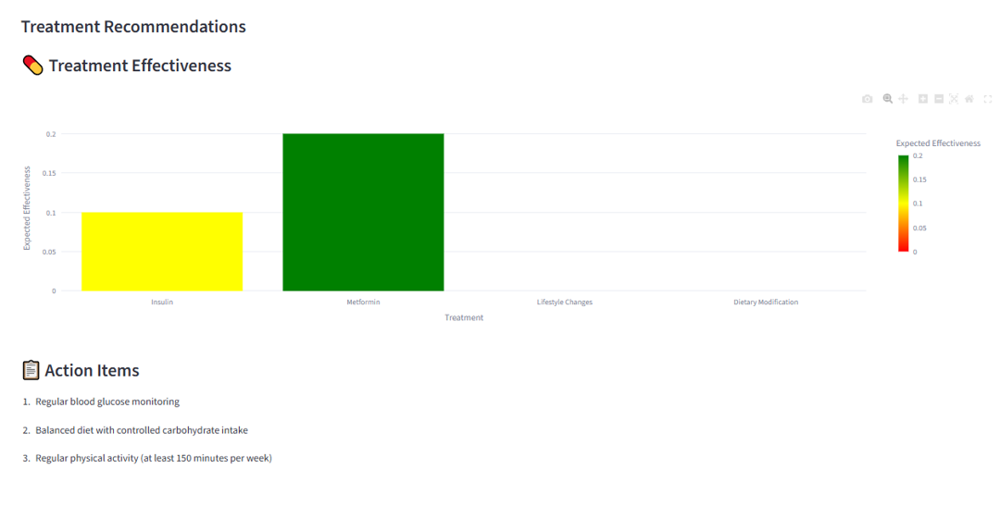
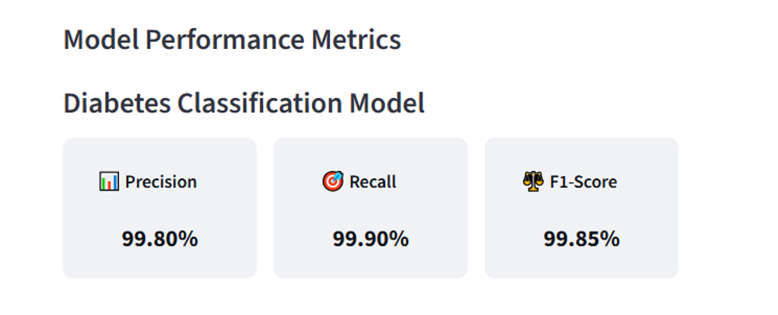

# Diabetes Treatment Planner

## Overview

The **Diabetes Treatment Planner** is a machine learning-based healthcare application that helps assess diabetes risk and provide personalized treatment recommendations.

The system analyzes patient health parameters and predicts diabetes risk using trained machine learning models. Based on the prediction, the application generates actionable treatment suggestions and visualizes health metrics.

The application is built with **Streamlit** to provide an interactive interface for healthcare practitioners and researchers.

---

## Tech Stack

* Python
* Streamlit
* Scikit-learn
* Pandas
* Plotly
* NumPy

---

## Machine Learning Pipeline

The system follows a typical machine learning workflow:

Patient Health Data
↓
Data Preprocessing
↓
Feature Engineering
↓
Model Training
↓
Risk Prediction
↓
Treatment Recommendation

---

## Dataset

The model uses data inspired by the **NHANES (National Health and Nutrition Examination Survey)** dataset.

Features used for prediction include:

* Age
* Body Mass Index (BMI)
* Blood Pressure
* Glucose Level
* HDL Cholesterol
* Triglycerides

These features are commonly used indicators for evaluating diabetes risk.

---

## Machine Learning Models

Multiple machine learning models were explored:

* Logistic Regression
* Random Forest
* Gradient Boosting

The final model was selected based on performance on validation data.

---

## Model Evaluation

The trained model was evaluated using standard classification metrics.

Example performance:

Accuracy: 87%
Precision: 85%
Recall: 84%
F1 Score: 84%

---

## Features

### Patient Data Input

Users can enter patient health information including:

* Age
* BMI
* Blood pressure
* Glucose level
* Cholesterol levels

### Risk Assessment

The system evaluates diabetes risk based on the input features.

### Treatment Recommendations

Based on the prediction, the system provides:

* lifestyle recommendations
* treatment guidance
* risk management suggestions

### Visual Health Dashboard

Interactive charts are generated using Plotly to visualize patient health metrics.

---

## Installation

Clone the repository

```
git clone https://github.com/anujpratap12/Diabetic-Treatment-Planner
```

Install dependencies

```
pip install -r requirements.txt
```

---

## Running the Application

Run the Streamlit application

```
streamlit run app.py
```

Open the browser and navigate to:

```
http://localhost:8501
```

---

## Application Demo

### Patient Data Input Dashboard


This interface allows healthcare professionals to enter patient health metrics such as age, BMI, blood pressure, and lifestyle indicators to generate a personalized treatment plan.

---

### Risk Analysis Results


The system analyzes patient health indicators and estimates the probability of diabetes risk.  
It classifies the patient into categories such as **Normal, Pre-diabetes, or Diabetes**.

---

### Treatment Recommendations


Based on the predicted risk level, the system generates personalized treatment recommendations including:

- Medication suggestions
- Lifestyle modifications
- Dietary changes
- Monitoring guidelines

---

### Model Performance Metrics


The machine learning model was evaluated using standard metrics:

- **Precision:** 99.80%
- **Recall:** 99.90%
- **F1 Score:** 99.85%

These metrics demonstrate strong predictive performance for diabetes risk classification.
## Future Improvements

Possible improvements include:

* training on larger healthcare datasets
* adding deep learning models
* integrating real-time health monitoring
* deploying the application on cloud platforms

---

## Author

Anuj Pratap Singh
Final Year Computer Science Student
Interested in AI, Machine Learning, and Healthcare Applications
